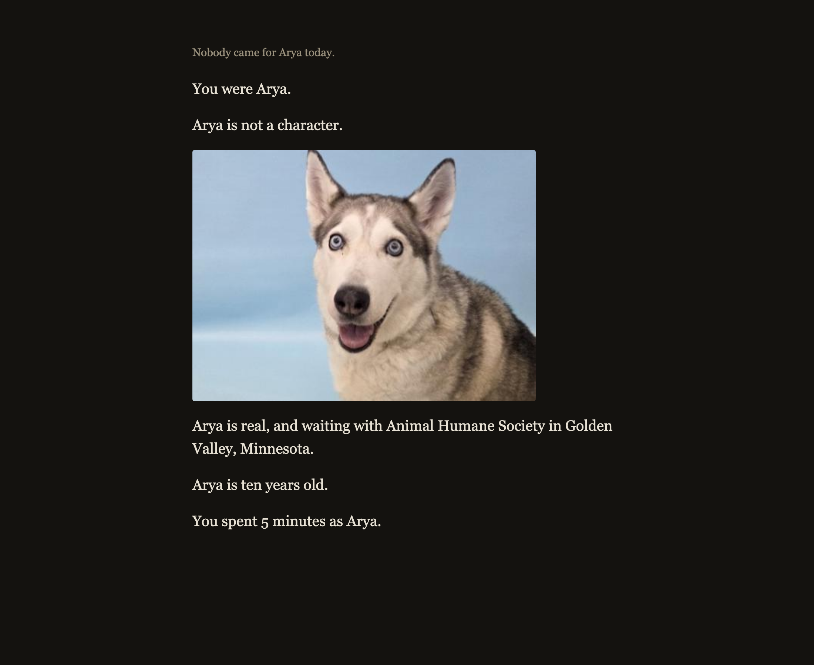

# GOOD DOG

**Play it: https://good-dog.fly.dev**

A game where you are the dog. The dog is real.

You spend three days in a shelter as a real adoptable dog, one of twelve taken from real shelter listings. You cannot speak, so you bark, whine, growl or stay quiet, and you watch it land wrong. At the end you learn the dog you were is real, and you get the link to their listing.



## Run it

```
go run ./cmd/server
```

That serves the game and the API on http://localhost:8080 as a single binary with the frontend embedded. For frontend work, run the dev server alongside it:

```
cd web && npm install && npm run dev
```

Copy `.env.example` to `.env` and fill in the keys. Without them the game still runs: it falls back to the twelve fixture dogs and plays the night as text.

## How it works

Three layers, one law.

**Reality** is the listing: real name, real photo, real shelter, real status. This layer never invents anything. **Interpretation** is the personality, the sensory language and the radio, all built by a model that is only ever allowed to work from facts the first layer verified. **Game** is what you do: scent, bark, visitors, trust, night, the reveal.

The engine owns truth and the model owns wording. A model never decides what happens next. Real listing text goes through an extraction step that keeps only verified fields, then a generation step builds the dog from those fields alone. A grounding eval suite in [cmd/evals](cmd/evals) checks generated text against the listing it came from, and it is run by hand before any prompt change ships.

Everything spoken is recorded ahead of time into a disk cache and shipped in the image. Nothing is generated while somebody is playing.

More in [docs/game-design.md](docs/game-design.md) and [docs/tech-stack.md](docs/tech-stack.md).

## Where the dogs come from

Twelve real dogs, each taken from a real shelter listing and checked by hand, carried in the repo as [fixtures/dogs.json](fixtures/dogs.json) with the listing url and the description text quoted verbatim. Every photo, name, breed, age and shelter shown in the game comes from that listing rather than from a model.

They are read through an `AnimalProvider` interface so a live adoption feed can replace the fixture set. That live provider is not built. The dogs are real, the listings are real, and the game reads them from a file rather than from an API, so a dog adopted since the file was made will still appear. This is why the reveal says a dog is **still listed** rather than still waiting: that is a fact about a web page, and the listing itself is the thing to trust.

## Dependencies and credits

Backend, Go 1.25, standard library for everything except:

- [modernc.org/sqlite](https://modernc.org/sqlite) v1.56.0, the database. Pure Go, so the binary builds with CGO off

Frontend:

- [React](https://react.dev) 18, for the UI chrome only. The game loop is plain TypeScript on a canvas
- [Vite](https://vite.dev) 6, build and dev server
- [Vitest](https://vitest.dev) 3, tests
- [TypeScript](https://typescriptlang.org) 5.8

Services:

- [Google Gemini](https://ai.google.dev), structured output for the dog sheets and the radio
- [ElevenLabs](https://elevenlabs.io), library voices for the radio and the sound effects API for the dog's own voice
- [Fly.io](https://fly.io), one machine and one volume

Listings from [Animal Humane Society](https://www.animalhumanesociety.org) and [Ruff Start Rescue](https://www.ruffstartrescue.org), in Minnesota. The words in the About panel are theirs, quoted rather than rewritten.

## Post deadline commits

The tag `v0.1.0-challenge` marks the state of the repo at the challenge deadline. Anything committed after it is listed here, so judges can tell the submission from what came later.

Nothing yet.

## Setup after cloning

```
git config core.hooksPath .githooks
```
